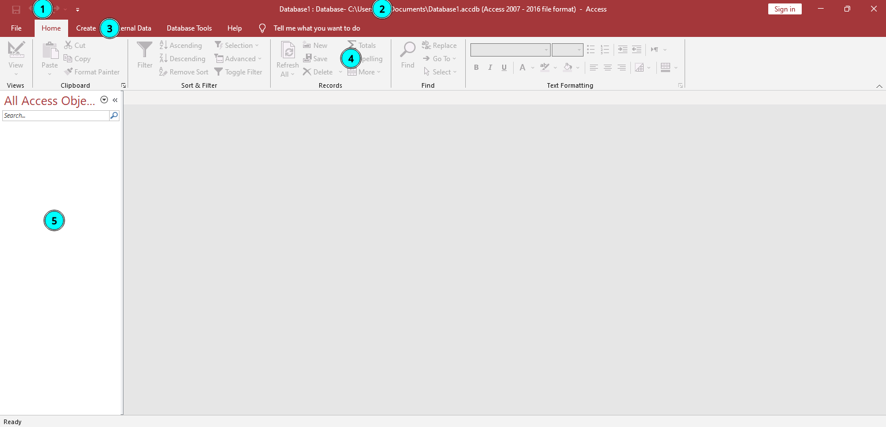

# Microsoft Access (MS Access)

Microsoft Access is a powerful database software package or program that can be used to create and manage databases.

## Parts of MS Access User Interface

1. Quick Access Toolbar
2. Title Bar
3. MS Access Button
4. Ribbon
5. Navigation Pane
